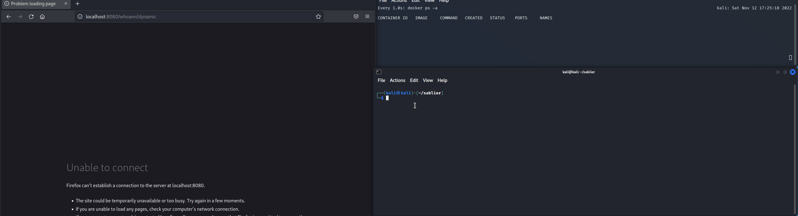
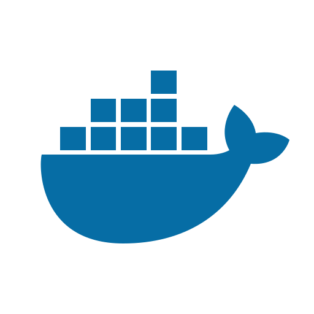

[](https://goreportcard.com/report/github.com/sablierapp/sablier)
[](https://discord.gg/WXYp59KeK9)
[](https://scorecard.dev/viewer/?uri=github.com/sablierapp/sablier)

Free and open-source software that starts workloads on demand and stops them after a period of inactivity.

It integrates with [reverse proxy plugins](#usage-with-reverse-proxies) (Traefik, Caddy, Nginx, Envoy, etc.) to intercept incoming requests, wake up sleeping workloads, and display a waiting page until they're ready.



Whether you're running on a resource-constrained device like a **Raspberry Pi**, managing a **QA environment** used only once a week, or reducing cloud costs by scaling idle workloads to zero — Sablier is built for you.

**Key features:**
- On-demand start/stop for Docker, Kubernetes, Podman, and Proxmox LXC workloads
- Customizable waiting UI with themes while workloads warm up
- [Webhook notifications](#webhooks) when instances start or stop
- [Prometheus metrics](#metrics) for monitoring session and workload activity
- [OpenTelemetry tracing](#tracing) for end-to-end request observability
- Stop or pause strategies to maximize resource reclamation on constrained hardware
- [Scale mode](#scale-mode): throttle CPU and memory when idle instead of stopping, for zero-cold-start workloads
- [Anti-affinity](#anti-affinity): make a workload back off automatically while another group is active, to avoid GPU/RAM contention

---

- [Installation](#installation)
  - [Use the Docker image](#use-the-docker-image)
  - [Use the binary distribution](#use-the-binary-distribution)
  - [Compile your binary from the sources](#compile-your-binary-from-the-sources)
  - [Use the Helm Chart](#use-the-helm-chart)
- [Quick Start](#quick-start)
- [Configuration](#configuration)
  - [Configuration File](#configuration-file)
  - [Environment Variables](#environment-variables)
  - [Arguments](#arguments)
- [Providers](#providers)
  - [Docker](#docker)
  - [Docker Swarm](#docker-swarm)
  - [Podman](#podman)
  - [Kubernetes](#kubernetes)
  - [Proxmox LXC](#proxmox-lxc)
- [Scale Mode](#scale-mode)
- [Webhooks](#webhooks)
- [Observability](#observability)
  - [Metrics](#metrics)
  - [Tracing](#tracing)
- [Performance](#performance)
- [Usage with Reverse Proxies](#usage-with-reverse-proxies)
  - [Apache APISIX](#apache-apisix)
  - [Caddy](#caddy)
  - [Envoy](#envoy)
  - [Istio](#istio)
  - [Nginx](#nginx)
  - [Traefik](#traefik)
- [Community](#community)
- [Support](#support)
- [Sponsor](#sponsor)
  - [DigitalOcean](#digitalocean)


## Installation

You can install Sablier using one of the following methods:

- [Use the Docker image](#use-the-docker-image)
- [Use the binary distribution](#use-the-binary-distribution)
- [Compile your binary from the sources](#compile-your-binary-from-the-sources)
- [Use the Helm Chart](#use-the-helm-chart)

### Use the Docker image



<!-- x-release-please-start-version -->


<!-- x-release-please-end -->

- **Docker Hub**: [sablierapp/sablier](https://hub.docker.com/r/sablierapp/sablier)
- **GitHub Container Registry**: [ghcr.io/sablierapp/sablier](https://github.com/sablierapp/sablier/pkgs/container/sablier)
  
Choose one of the Docker images and run it with a sample configuration file:

- [sablier.yaml](https://raw.githubusercontent.com/sablierapp/sablier/main/sablier.sample.yaml)

<!-- x-release-please-start-version -->
```bash
docker run -p 10000:10000 -v /var/run/docker.sock:/var/run/docker.sock sablierapp/sablier:1.14.0
```

> [!TIP]
> Verify the image signature to ensure authenticity:
> ```bash
> gh attestation verify --owner sablierapp oci://sablierapp/sablier:1.14.0
> ```

<!-- x-release-please-end -->

### Use the binary distribution


Grab the latest binary from the [releases](https://github.com/sablierapp/sablier/releases) page and run it:

```bash
./sablier --help
```

> [!TIP]
> Verify the binary signature to ensure authenticity:
> ```bash
> gh attestation verify sablier-1.10.3-linux-amd64.tar.gz -R sablierapp/sablier
> ```

### Compile your binary from the sources

```bash
git clone git@github.com:sablierapp/sablier.git
cd sablier
make
# Output will change depending on your distro
./sablier_draft_linux-amd64
```

### Use the Helm Chart


Deploy Sablier to your Kubernetes cluster using the official Helm chart for production-ready deployments.

Add the Sablier Helm repository:

```bash
helm repo add sablierapp https://sablierapp.github.io/helm-charts
helm repo update
```

Install Sablier:

```bash
helm install sablier sablierapp/sablier
```

📚 **[Full Documentation](https://github.com/sablierapp/helm-charts/tree/main/charts/sablier)** | 💻 **[Chart Repository](https://github.com/sablierapp/helm-charts)**

---

## Quick Start

> [!NOTE]
> This quick start demonstrates Sablier with the **Docker provider**.
> 
> For other providers, see the [Providers](#providers) section.

<!-- omit in toc -->
### 1. Start your container to scale to zero

Run your container with Sablier labels:

```bash
docker run -d --health-cmd "/mimic healthcheck" -p 8080:80 --name mimic \
  --label sablier.enable=true \
  --label sablier.group=demo \
  sablierapp/mimic:v0.3.3 \
  -running -running-after=5s \
  -healthy=true -healthy-after=5s
```

Here we run [sablierapp/mimic](https://github.com/sablierapp/mimic), a configurable web-server for testing purposes.

> [!CAUTION]
> You should **always** use a healthcheck with your application that needs to be scaled to zero.
>
> Without a healtheck, Sablier cannot distinguish a started container from a container ready to receive incoming requests.

<!-- omit in toc -->
### 2. Stop the Container

Stop the container to simulate a scaled-down state:

```bash
docker stop mimic
```

> [!TIP]
> Sablier can **automatically** stop containers at startup using the `--provider.auto-stop-on-startup` flag, which will stop all containers with `sablier.enable=true` labels.

<!-- omit in toc -->
### 3. Start Sablier

Start the Sablier server with the Docker provider:

```bash
docker run --name sablier \
  -p 10000:10000 \
  -v /var/run/docker.sock:/var/run/docker.sock \
  sablierapp/sablier:1.10.5 \
  start --provider.name=docker
```

<!-- omit in toc -->
### 4. Request a Session

Call the Sablier API to start a session for the `demo` group:

```bash
curl -v http://localhost:10000/api/strategies/blocking\?group\=demo\&session_duration\=20s
* Request completely sent off
< HTTP/1.1 200 OK
< X-Sablier-Session-Status: ready
```

Sablier will start the mimic container automatically for 20 seconds..

> [!TIP]
> Check out the [Usage with Reverse Proxies](#usage-with-reverse-proxies) section to integrate Sablier with **Traefik**, **Caddy**, **Nginx**, and more.

<!-- omit in toc -->
### 5. Verify the Container is Running

```bash
docker ps | grep mimic
```

<!-- omit in toc -->
### 6. Wait for Session Expiration

After the session duration (20 seconds in this example), Sablier will automatically stop the container.

```bash
# Wait 20 seconds, then check
docker ps -a | grep mimic
```

The container should be stopped.

---

## Configuration

📚 **[Full Documentation](https://sablierapp.dev/#/configuration)**

There are three ways to configure Sablier:

1. [In a configuration file](#configuration-file)
2. [As environment variables](#environment-variables)
3. [As command-line arguments](#arguments)

Configuration sources are evaluated in the order listed above with later methods overriding earlier ones.

If no value is provided for a given option, a default value is used.

### Configuration File

At startup, Sablier searches for a configuration file named sablier.yml (or sablier.yaml) in:

- `/etc/sablier/`
- `$XDG_CONFIG_HOME/`
- `$HOME/.config/`
- `.` *(the working directory)*

You can override this using the `configFile` argument.

```bash
sablier --configFile=path/to/myconfigfile.yml
```

```yaml
provider:
  # Provider to use to manage containers (docker, swarm, kubernetes, podman, proxmox_lxc)
  name: docker
  # Reject requests for containers/services that don't have the Sablier enable label
  reject-unlabeled-requests: false
  # Verify that the Sablier enable label is present when an instance expires
  verify-enabled-on-expiration: false
  docker:
    # Strategy to use when stopping containers (stop or pause)
    strategy: stop
server:
  # The server port to use
  port: 10000
  # The base path for the API
  base-path: /
  metrics:
    # Enable Prometheus metrics endpoint
    enabled: true
storage:
  # File path to save the state (default stateless)
  file:
sessions:
  # The default session duration (default 5m)
  default-duration: 5m
  # The expiration checking interval.
  # Higher duration gives less stress on CPU.
  # If you only use sessions of 1h, setting this to 5m is a good trade-off.
  expiration-interval: 20s
logging:
  level: info
strategy:
  dynamic:
    # Custom themes folder, will load all .html files recursively (default empty)
    custom-themes-path:
    # Show instances details by default in waiting UI
    show-details-by-default: true
    # Default theme used for dynamic strategy (default "hacker-terminal")
    default-theme: hacker-terminal
    # Default refresh frequency in the HTML page for dynamic strategy
    default-refresh-frequency: 5s
  blocking:
    # Default timeout used for blocking strategy (default 1m)
    default-timeout: 1m
webhooks:
  endpoints:
    # Notify an uptime-monitoring service every time an instance starts or stops.
    # - url: https://uptime.example.com/api/push/xxxxxxxx
    #   headers:
    #     Authorization: "Bearer <token>"
    #   events:
    #     - started
    #     - stopped
tracing:
  # Set enabled: true to export OpenTelemetry traces.
  enabled: false
  # exporterType selects the trace backend: "otlphttp" (default) or "stdout".
  exporterType: otlphttp
  # endpoint is the OTLP collector base URL (scheme + host + optional port).
  # For Jaeger: http://jaeger:4318
  # For Grafana Tempo: http://tempo:4318
  endpoint: http://localhost:4318
  # serviceName is the logical name that appears in the tracing backend.
  serviceName: sablier
  # samplingRate controls the fraction of requests traced (0.0 – 1.0).
  samplingRate: 1.0
```

### Environment Variables

Environment variables follow the same structure as the configuration file and are prefixed with `SABLIER_`. For example:

```yaml
strategy:
  dynamic:
    custom-themes-path: /my/path
```

becomes

```bash
SABLIER_STRATEGY_DYNAMIC_CUSTOM_THEMES_PATH=/my/path
```

### Arguments

To list all available arguments:

<!-- x-release-please-start-version -->
```bash
sablier --help

# or

docker run sablierapp/sablier:1.14.0 --help
```
<!-- x-release-please-end -->

Command-line arguments follow the same structure as the configuration file. For example:

```yaml
strategy:
  dynamic:
    custom-themes-path: /my/path
```

becomes

```bash
sablier start --strategy.dynamic.custom-themes-path /my/path
```

<!--
## Reference
TODO: Add link to full auto-generated reference
-->

## Providers

### Docker


Sablier integrates seamlessly with Docker Engine to manage container lifecycle based on demand.

**Features:**
- Connects to the Docker socket
- Starts/Stops containers
- Compatible with Docker Compose

📚 **[Full Documentation](https://sablierapp.dev/#/providers/docker)**

---

### Docker Swarm


Sablier supports Docker Swarm mode for managing services across a cluster of Docker engines.

**Features:**
- Connects to the Docker socket (Manager node)
- Scales services to 0 and back
- Compatible with Docker Stack

📚 **[Full Documentation](https://sablierapp.dev/#/providers/docker_swarm)**

---

### Podman


Sablier works with Podman, the daemonless container engine, providing the same dynamic scaling capabilities as Docker.

**Features:**
- Connects to the Podman socket
- Starts/Stops containers
- Supports rootless containers

📚 **[Full Documentation](https://sablierapp.dev/#/providers/podman)**

---

### Kubernetes


Sablier provides native Kubernetes support for managing deployments, scaling workloads dynamically.

**Features:**
- Connects to the Kubernetes API
- Scales Deployments and StatefulSets to 0 and back
- Supports in-cluster and out-of-cluster configuration

📚 **[Full Documentation](https://sablierapp.dev/#/providers/kubernetes)**

---

### Proxmox LXC


Sablier supports Proxmox VE for managing LXC containers on demand via the Proxmox API.

**Features:**
- Connects to the Proxmox VE API with token authentication
- Starts/Stops LXC containers
- Discovers containers by `sablier` tag

📚 **[Full Documentation](https://sablierapp.dev/#/providers/proxmox_lxc)**

## Scale Mode

By default, Sablier stops (or pauses) workloads when a session expires and restarts them on the next request. **Scale mode** is an alternative: instead of stopping a container, Sablier throttles its CPU, memory, and (on Docker) block I/O to a minimal idle allocation, then restores full resources the moment a new session arrives.

Because the container never stops, there is **no cold-start latency** — ideal for resource-constrained environments like a Raspberry Pi where you want to reclaim most of the hardware while keeping response times acceptable.

Scale mode is controlled entirely through labels:

```yaml
labels:
  - "sablier.enable=true"
  - "sablier.group=myapp"
  # Idle state: keep running but throttle resources
  - "sablier.idle.replicas=1"
  - "sablier.idle.cpu=0.1"
  - "sablier.idle.memory=64m"
  # Active state: full resources when a session is requested
  - "sablier.active.replicas=1"
  - "sablier.active.cpu=2.0"
  - "sablier.active.memory=512m"
```

| Label | Description |
|---|---|
| `sablier.idle.replicas` | Replica count while idle. Set to `0` to stop (default behaviour), `1+` to keep running. |
| `sablier.idle.cpu` | CPU limit while idle (e.g. `0.1` for 10% of one core). Requires `idle.replicas >= 1`. |
| `sablier.idle.memory` | Memory limit while idle (e.g. `64m`). Requires `idle.replicas >= 1`. |
| `sablier.active.replicas` | Replica count when a session is active. |
| `sablier.active.cpu` | CPU limit restored when a session is active. |
| `sablier.active.memory` | Memory limit restored when a session is active. |
| `sablier.idle.blkio-weight` / `sablier.active.blkio-weight` | Block I/O weight `10`–`1000` (Docker only). |
| `sablier.idle.blkio-device-{read,write}-{bps,iops}` | Per-device I/O throughput/IOPS limits (Docker only). |

> **Docker only:** Block I/O throttling is supported on the Docker provider. Per-device limits (`blkio-*-device`, `blkio-device-*`) require a Docker daemon with API version ≥ 1.55 ([moby/moby#52650](https://github.com/moby/moby/issues/52650)); Sablier logs a warning on older daemons. See the [configuration reference](./docs/configuration.md#block-io-blkio-throttling) for the full list.

📚 **[Full Example](./examples/scale-mode/)**

### Anti-Affinity

On a machine where several heavy services share a non-shareable resource (GPU VRAM, RAM), running two at once can OOM. **Anti-affinity** lets an instance back off automatically while another group is in use:

```yaml
labels:
  - "sablier.enable=true"
  - "sablier.anti-affinity=streaming"   # yield whenever the "streaming" group is active
```

When any session for the `streaming` group is active, every instance that declared an anti-affinity against it is forced idle (stopped, or throttled to its idle profile in scale mode) and restored once the group is no longer active. Multiple groups can be listed comma-separated.

📚 **[Anti-Affinity documentation](./docs/configuration.md#anti-affinity)** | **[Full Example](./examples/anti-affinity/)**

---

## Webhooks

Sablier can POST a normalized JSON notification to one or more HTTP endpoints whenever a managed instance starts or stops. Because Sablier sits in front of every supported provider, webhooks act as a **unified, provider-agnostic event stream** — your receiver always gets the same payload structure regardless of the underlying runtime.

**Common uses:**
- Push heartbeats to an uptime monitor such as [Uptime Kuma](https://github.com/louislam/uptime-kuma)
- Trigger CI/CD pipelines or automation on instance lifecycle events
- Feed a central observability or alerting bus

📚 **[Full Documentation](https://sablierapp.dev/#/webhooks)**

---

## Observability

### Metrics

Sablier exposes a [Prometheus](https://prometheus.io/)-compatible `/metrics` endpoint. Enable it in your configuration:

```yaml
server:
  metrics:
    enabled: true
```

---

### Tracing

Sablier supports distributed tracing via [OpenTelemetry](https://opentelemetry.io/). When enabled, every incoming HTTP request and every call to the underlying container provider is captured as a span and exported to an OTLP-compatible backend such as [Jaeger](https://www.jaegertracing.io/) or [Grafana Tempo](https://grafana.com/oss/tempo/). Trace context is propagated using the W3C TraceContext format, so if your reverse proxy injects a `traceparent` header, Sablier will join the existing trace.

```yaml
tracing:
  enabled: true
  exporterType: otlphttp
  endpoint: http://localhost:4318
  serviceName: sablier
  samplingRate: 1.0
```

📚 **[Full Documentation](https://sablierapp.dev/#/tracing)**

---

## Performance

Sablier adds **~1.5–2 ms of latency** per request at steady state (session cache hot, container already running), sustaining ~5,000–5,750 req/s on a single core. Cold starts depend entirely on container startup time; once the container is ready, subsequent requests return to warm latency immediately.

| Scenario | Req/s | p50 latency | p99 latency |
|---|---|---|---|
| Blocking, warm session | 5,751 | 1.54 ms | 4.94 ms |
| Dynamic, warm session | 5,066 | 1.81 ms | 4.62 ms |
| Dynamic, not-ready | 4,663 | 1.93 ms | 5.88 ms |

📚 **[Full benchmark methodology and results](https://sablierapp.dev/#/performance)**

---

## Usage with Reverse Proxies

Sablier is an API server that manages workload lifecycle. To automatically wake up workloads when users access your services, you can integrate Sablier with reverse proxy plugins.

These plugins intercept incoming requests, call the Sablier API to start sleeping workloads, and display a waiting page until they're ready.

### Apache APISIX


Sablier integrates with Apache APISIX through a Proxy-WASM plugin, enabling dynamic scaling for your services.

**Quick Start:**
1. Install the Sablier Proxy-WASM plugin
2. Configure APISIX routes with Sablier plugin settings
3. Define your scaling labels on target services

📚 **[Full Documentation](https://github.com/sablierapp/sablier-proxywasm-plugin)** | 💻 **[Plugin Repository](https://github.com/sablierapp/sablier-proxywasm-plugin)**

---

### Caddy


Sablier provides a native Caddy module for seamless integration with Caddy v2.

**Quick Start:**
1. Build Caddy with the Sablier module using `xcaddy`
2. Add Sablier directives to your Caddyfile
3. Configure dynamic scaling rules

📚 **[Full Documentation](https://github.com/sablierapp/sablier-caddy-plugin)** | 💻 **[Plugin Repository](https://github.com/sablierapp/sablier-caddy-plugin)**

---

### Envoy


Sablier integrates with Envoy Proxy through a Proxy-WASM plugin for high-performance dynamic scaling.

**Quick Start:**
1. Deploy the Sablier Proxy-WASM plugin
2. Configure Envoy HTTP filters
3. Set up scaling labels on your workloads

📚 **[Full Documentation](https://github.com/sablierapp/sablier-proxywasm-plugin)** | 💻 **[Plugin Repository](https://github.com/sablierapp/sablier-proxywasm-plugin)**

---

### Istio


Sablier works with Istio service mesh using the Proxy-WASM plugin for intelligent traffic management.

**Quick Start:**
1. Install the Sablier Proxy-WASM plugin in your Istio mesh
2. Configure EnvoyFilter resources
3. Annotate your services with Sablier labels

📚 **[Full Documentation](https://github.com/sablierapp/sablier-proxywasm-plugin)** | 💻 **[Plugin Repository](https://github.com/sablierapp/sablier-proxywasm-plugin)**

---

### Nginx


Sablier integrates with Nginx through a WASM module, bringing dynamic scaling to your Nginx deployments.

**Quick Start:**
1. Build Nginx with WASM support
2. Load the Sablier Proxy-WASM plugin
3. Configure Nginx locations with Sablier directives

📚 **[Full Documentation](https://github.com/sablierapp/sablier-proxywasm-plugin)** | 💻 **[Plugin Repository](https://github.com/sablierapp/sablier-proxywasm-plugin)**

---

### Traefik


Sablier provides a powerful middleware plugin for Traefik, the cloud-native application proxy.

**Quick Start:**
1. Add the Sablier plugin to your Traefik static configuration
2. Create Sablier middleware in your dynamic configuration
3. Apply the middleware to your routes

📚 **[Full Documentation](https://github.com/sablierapp/sablier-traefik-plugin)** | 💻 **[Plugin Repository](https://github.com/sablierapp/sablier-traefik-plugin)**

## Community

Join our Discord server to discuss and get support!

[](https://discord.gg/WXYp59KeK9)

## Support

This project is maintained by a single developer in their free time. If you find Sablier useful, here are some ways you can show your support:

⭐ **Star the repository** - It helps others discover the project and motivates continued development

🤝 **Contribute** - Pull requests are always welcome! Whether it's:
- Bug fixes
- New features
- Documentation improvements
- Test coverage

📚 **Share your usage** - We'd love to see how you're using Sablier! Consider:
- Opening a discussion to share your setup
- Contributing examples of your deployment configurations
- Writing a blog post or tutorial

💬 **Engage with the community** - Ask questions, report issues, or help others in [discussions](https://github.com/sablierapp/sablier/discussions)

Every contribution, no matter how small, makes a difference and is greatly appreciated! 🙏

For detailed support options, see [SUPPORT.md](SUPPORT.md).

## Sponsor

If you find Sablier valuable and want to support its development, please consider sponsoring the project:

💖 **[Sponsor on GitHub](https://github.com/sponsors/acouvreur)** - Your sponsorship helps keep this project maintained and actively developed

Your support helps:
- Keep the project maintained and up-to-date
- Dedicate more time to bug fixes and new features
- Improve documentation and examples
- Support the broader open-source ecosystem

Every contribution, no matter the size, makes a real difference. Thank you for considering! 🙏

### DigitalOcean

<p>This project is supported by:</p>
<p>
  <a href="https://www.digitalocean.com/?refcode=67b25d34f559&utm_campaign=Referral_Invite&utm_medium=Referral_Program&utm_source=badge">
    
  </a>
</p>
