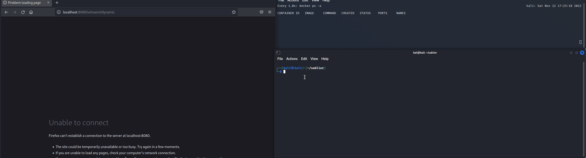

# Sablier - Scale to Zero

Sablier is a **free** and **open-source** software that scales your workloads on demand.

Your workloads can be a Docker container, a Kubernetes deployment, and more (see [providers](providers/overview) for the full list).

Sablier is an API that starts containers for a given duration.

It provides integrations with multiple reverse proxies and different loading strategies.

This allows you to start your containers on demand and shut them down automatically when there's no activity.

## Glossary

Throughout this documentation, we use these terms to remain provider-agnostic:

- **Session**: A session is a set of **instances**
- **Instance**: An instance is either a Docker container, Docker Swarm service, Kubernetes deployment, or Kubernetes StatefulSet

## Credits

- [Hourglass icons created by Vectors Market - Flaticon](https://www.flaticon.com/free-icons/hourglass)
- [tarampampam/error-pages](https://github.com/tarampampam/error-pages/) for the themes