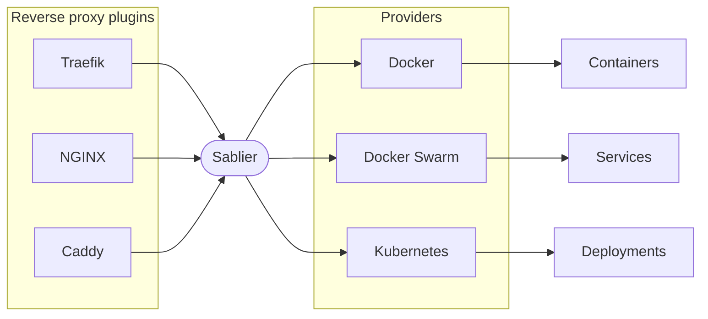

Sablier starts your workloads on the first request and stops them once they go idle. It sits **between your reverse proxy and your workloads** and never modifies the workloads themselves. You tell Sablier which ones to manage, and how, with labels.

## The moving pieces

| Piece | What it is |
|-------|------------|
| [Provider](/tutorials/providers/) | How Sablier talks to your platform (Docker, Docker Swarm, Kubernetes, Podman, Proxmox LXC). One provider is configured per Sablier server. |
| Instance | A single workload Sablier manages: a container, a service, a Deployment, and so on. |
| [Label](/reference/labels/) | How you opt an instance in and configure it. Sablier discovers what it manages by reading labels from the provider. |
| [Group](/concepts/groups/) | A named handle for one or more instances. Your reverse proxy targets a group, not individual instance names. |
| Session | The set of instances started together for a request. It stays active while traffic keeps arriving and expires after a period of inactivity. |
| [Strategy](/concepts/strategies/) | How the reverse-proxy plugin waits while instances start, either a self-refreshing waiting page (dynamic) or a held request (blocking). |
| [Reverse-proxy plugin](/tutorials/reverse-proxies/) | The integration inside your proxy that intercepts requests and calls the Sablier API. |

If these terms are new to you, the [Glossary](/reference/glossary/) gives a one-line definition of each.

## The request lifecycle

{}

### A request arrives

A user hits a route on your reverse proxy that is protected by the Sablier plugin.

### The plugin asks Sablier to start the group

The plugin calls the Sablier API for the [group](/concepts/groups/) configured on that route and asks it to report readiness.

### Sablier starts the instances

Sablier looks up which instances belong to that group (discovered from your [labels](/concepts/configuring-instances/)) and asks the [provider](/tutorials/providers/) to start them.

### The user waits, according to the strategy

While the instances start, the [strategy](/concepts/strategies/) decides what the user sees: a themed waiting page that refreshes itself (**dynamic**), or a request held open until everything is ready (**blocking**).

### Traffic flows normally

Once the instances report ready, the request is proxied through as if Sablier were not there.

### Idle instances are stopped

Sablier keeps the [session](/reference/glossary/) alive while requests keep arriving. After the configured period of inactivity, the session expires and Sablier asks the provider to stop the instances, freeing their resources until the next request.

{}

## The three things you configure

Sablier has no central file that lists your applications. Instead you configure **three separate surfaces**, one for each actor in the flow above. The documentation is organised the same way.


  
  
  

