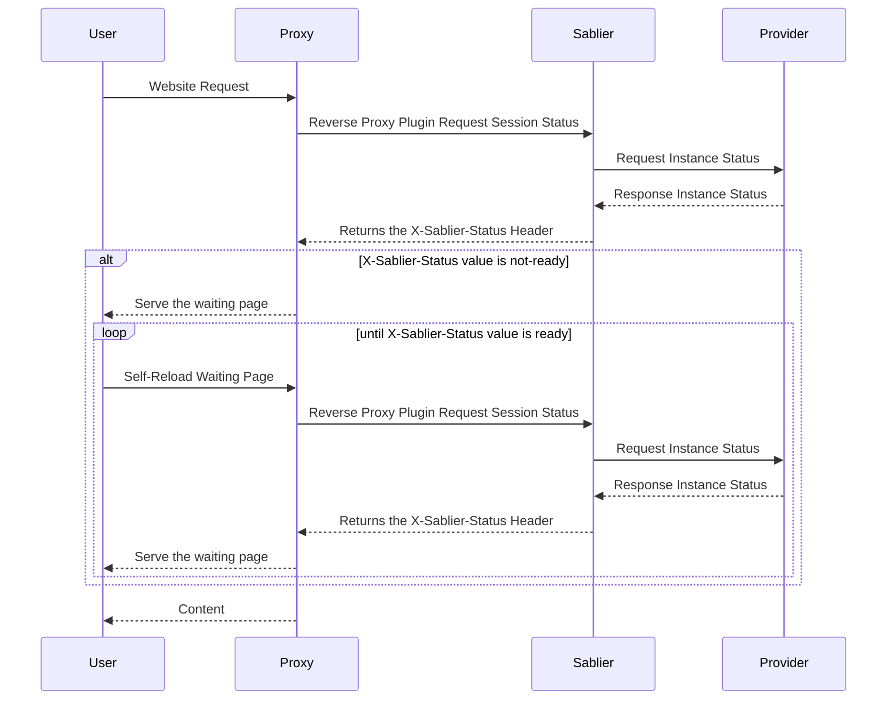
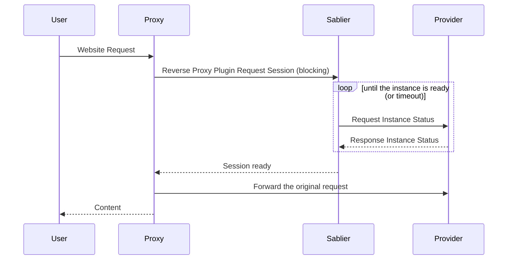

A **strategy** is how the reverse-proxy plugin behaves while Sablier is starting the instances for a session. Sablier offers two: the **dynamic** strategy shows a self-refreshing waiting page, and the **blocking** strategy holds the request open until everything is ready. Which one fits depends on who (or what) is making the request.

## Dynamic strategy

The **dynamic strategy** displays a waiting page while your session starts. The page refreshes itself until the instances report ready, then loads the real content.


This strategy is ideal for users accessing a frontend directly, as they'll see a loading page while their services start.


The waiting page is rendered from a [theme](/how-to-guides/loading-strategies/customize-theme/); use a built-in one or provide your own. To set up the dynamic strategy on a route, see [Show a waiting page](/how-to-guides/loading-strategies/show-waiting-page/).

## Blocking strategy

The **blocking strategy** holds the request until your session is ready. Nothing is served to the caller until Sablier reports the instances ready (or the wait times out), at which point the original request is forwarded.


This strategy is ideal for API communication, where clients expect to wait for a response.


To set up the blocking strategy on a route, see [Block until ready](/how-to-guides/loading-strategies/block-until-ready/).

## Choosing a strategy

- Reach for the **dynamic** strategy when a human is browsing directly. A themed waiting page is friendlier than a request that appears to hang, and it survives long start-up times without hitting client timeouts.
- Reach for the **blocking** strategy when the caller is another program (an API client, a webhook, a health probe) that simply expects to wait for a response and would not know what to do with an HTML waiting page.
