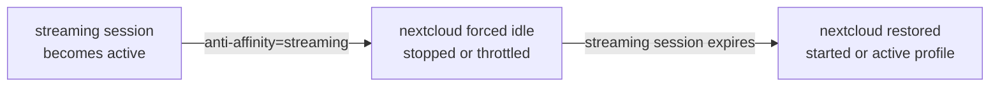



This guide shows you how to make an instance **back off automatically** whenever another workload is in use. An instance declares the groups it must yield to with the `sablier.anti-affinity` label:

```yaml
# compose.yml
services:
  # Plex is the "streaming" service.
  plex:
    image: plexinc/pms-docker
    labels:
      - "sablier.enable=true"
      - "sablier.group=streaming"

  # Nextcloud keeps running in the background, but must free the GPU/RAM
  # whenever a streaming session is active.
  nextcloud:
    image: nextcloud
    labels:
      - "sablier.enable=true"
      - "sablier.anti-affinity=streaming"   # yield to the "streaming" group
      # Optional: use scale mode so "idle" means throttled instead of stopped.
      - "sablier.idle.replicas=1"
      - "sablier.idle.cpu=0.5"
      - "sablier.active.cpu=4.0"
```

It is designed for machines where several heavy services compete for a shared, non-shareable resource, most commonly **GPU VRAM or RAM**, and running two of them at once causes an out-of-memory crash or severe slowdown.



How it works:

- When a session for the **`streaming`** group becomes active, every instance that declared `sablier.anti-affinity=streaming` is forced to its **idle** state:
  - a plain instance is **stopped** (or paused, depending on the strategy);
  - a scale-mode instance (`sablier.idle.replicas >= 1`) has its **idle resource profile** applied instead.
- When the `streaming` session **expires** and no other listed group is active, the instances Sablier forced idle are **restored**: restarted, or returned to their active resource profile.
- Multiple antagonist groups can be listed (`sablier.anti-affinity=streaming,transcoding`); the instance stays idle while **any** of them is active.

Behavior notes:

- Only instances Sablier **actually suppressed while they were running** are restored later. An instance that was already idle is left untouched.
- The relationship is **one-directional**: the declaring instance yields to the group, not the reverse.
- **Requesting a held instance:** while an antagonist group is active, a request for the backing-off instance does **not** start it. It is reported as `not-ready` with the message *"paused while group \"streaming\" is active (anti-affinity)"*, which appears on the waiting page (with `show_details`) and in the API response. A **blocking** request keeps waiting and will time out if the antagonist outlasts its timeout; the **dynamic** waiting page keeps refreshing and starts the instance automatically once the antagonist expires.
- Anti-affinity instances must be **Sablier-managed** (`sablier.enable=true`) so Sablier can stop and start them.
- Reconciliation is reactive (on session start and expiry) with a periodic safety net.
