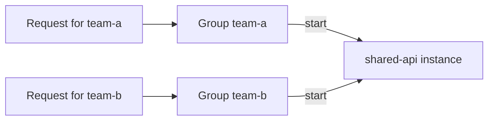



This guide shows you how to make an instance belong to more than one group at once by providing a **comma-separated** list in the `sablier.group` label:

```yaml
# compose.yml
services:
  shared-api:
    image: myorg/shared-api:latest
    restart: unless-stopped
    labels:
      - "sablier.enable=true"
      - "sablier.group=team-a,team-b"   # member of both groups
```

When a session is requested for **any** of its groups, the instance is started. A session for `team-a` starts every instance whose groups include `team-a`, including `shared-api`, and the same instance also starts for a `team-b` session.



Practical rules:

- Spaces around separators are ignored (`"team-a , team-b"` is equivalent to `"team-a,team-b"`).
- Duplicate group names are deduplicated silently.
- An instance that loses all its group membership (e.g. the label/tag removed at runtime) is dropped from every group it belonged to.
