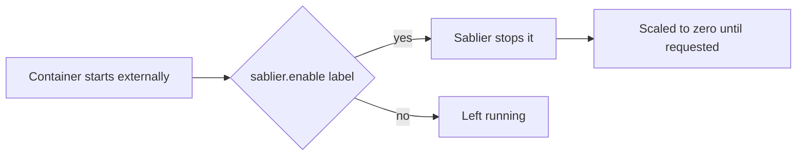

Automatically stop managed instances that start without Sablier having initiated them, so traffic is only ever served after a client explicitly requests the instance.

```yaml
# compose.yml
services:
  sablier:
    image: sablierapp/sablier:
    command:
      - start
      - --provider.name=docker
      - --provider.auto-stop-on-startup=true
      - --provider.auto-stop-externally-started=true
    volumes:
      - /var/run/docker.sock:/var/run/docker.sock

  managed:
    image: acouvreur/whoami:v1.10.2
    labels:
      - "sablier.enable=true"
      - "sablier.group=managed"
```

A container with the `sablier.enable=true` label is stopped again shortly after it starts externally. A container with no Sablier labels is ignored and keeps running.

Sablier manages containers labelled `sablier.enable=true`. Such a container can start without Sablier having initiated it, for example through `docker compose up`, a restart policy, or a manual `docker start`. You can have Sablier stop it automatically, so traffic is only ever served after a client explicitly requests the instance.



## When to use it

Use this when managed instances must stay scaled to zero until a request arrives, and you want to guard against them being brought up out-of-band.

## Flags

- [`--provider.auto-stop-on-startup`](/reference/cli/): stop managed instances that are already running when Sablier boots.
- [`--provider.auto-stop-externally-started`](/reference/cli/): continuously stop managed instances that start while Sablier is running.

See the [runnable example](https://github.com/sablierapp/sablier/tree/main/examples/auto-stop-externally-started).
