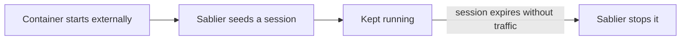

Seed a session for managed instances that start without Sablier having initiated them, keeping them running instead of stopping them on arrival.

```yaml
# compose.yml
services:
  sablier:
    image: sablierapp/sablier:1.14.0 # x-release-please-version
    command:
      - start
      - --provider.name=docker
      - --provider.auto-stop-on-startup=false
      - --provider.auto-warm-externally-started=true
      - --sessions.default-duration=1m
    volumes:
      - /var/run/docker.sock:/var/run/docker.sock

  managed:
    image: acouvreur/whoami:v1.10.2
    labels:
      - "sablier.enable=true"
      - "sablier.group=managed"
```

An externally-started managed container receives a seeded session and keeps running; once the session expires without traffic, Sablier stops it. A container with no Sablier labels is ignored.

This is the non-destructive counterpart to [stopping externally-started instances](/how-to-guides/lifecycle/auto-stop-externally-started/). A container labelled `sablier.enable=true` can start without Sablier having initiated it, for example through `docker compose up`, a deployment tool, or a manual `docker start`. When that happens, Sablier seeds a session for it using the default session duration instead of stopping it. The container keeps running until that session expires without traffic, then hibernates through the normal scale-to-zero lifecycle.




`--provider.auto-warm-externally-started` and `--provider.auto-stop-externally-started` are mutually exclusive; Sablier refuses to start with both enabled.


## When to use it

Use this when fresh deployments should be adopted into the session lifecycle rather than killed on arrival, so a just-deployed instance stays up long enough to serve initial traffic.

## Flags

- [`--provider.auto-warm-externally-started`](/reference/cli/): continuously seed a session for managed instances that were started externally.
- [`--provider.auto-stop-on-startup`](/reference/cli/): keep this `false` so already-running managed instances are not stopped at startup.
- [`--sessions.default-duration`](/reference/cli/): how long the seeded session lasts.

See the [runnable example](https://github.com/sablierapp/sablier/tree/main/examples/auto-warm-externally-started).
