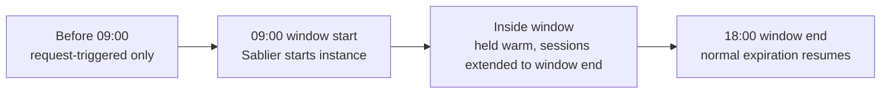



This guide shows you how to keep an instance **available during specific daily hours** with the `sablier.running-hours` and `sablier.running-days` labels:

```yaml
# compose.yml
services:
  myapp:
    image: myapp:latest
    restart: unless-stopped
    labels:
      - "sablier.enable=true"
      - "sablier.group=myapp"
      - "sablier.running-hours=09:00-18:00"
      - "sablier.running-days=Mon,Tue,Wed,Thu,Fri"
```

The instance is proactively started and held warm for the whole window regardless of traffic. Two labels drive it:

- **`sablier.running-hours`**: the daily window, 24-hour `HH:MM-HH:MM` (e.g. `09:00-18:00`). Overnight windows like `22:00-06:00` span midnight.
- **`sablier.running-days`**: optional, restricts the window to specific weekdays (comma-separated, full names or abbreviations, e.g. `Mon,Tue,Wed,Thu,Fri`). Defaults to every day.


`sablier.running-days` ships in the next release. On the current release, use `sablier.running-hours` on its own.




Behavior:

- At the beginning of the window, Sablier proactively starts the instance.
- During the window, request-triggered sessions are extended to the window end so the instance is not stopped mid-window.
- After the window ends, normal session expiration resumes.
- For overnight windows, the day is evaluated against the day the window **starts** (a `Fri` + `22:00-06:00` window runs from Friday 22:00 to Saturday 06:00).

## Timezone (`TZ`)

Running-hours are evaluated in the process local timezone.

- In the official Docker image, the binary embeds timezone database data and supports `TZ` out of the box.
- The container defaults to `TZ=UTC`.
- Override with an environment variable, e.g. `-e TZ=Europe/Paris`.

## Format rules

- `sablier.running-hours`: 24-hour `HH:MM-HH:MM`. If start is later than end, the window spans midnight. Unparseable values are ignored.
- `sablier.running-days`: comma-separated days; full names (`Monday`) and abbreviations (`Mon`); case-insensitive; whitespace ignored. Unparseable values are ignored (the window then applies every day).
