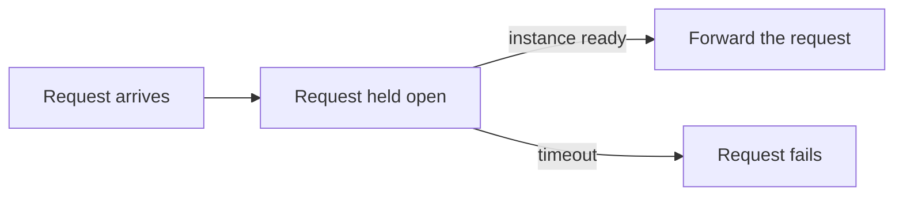

The **blocking** strategy holds the incoming request until your instances are ready, then forwards it.

```sh
--strategy.blocking.default-timeout
```

There is no waiting page; the client waits for the response. This is the right choice for APIs and any client that expects to wait for a reply rather than see an HTML loading page.



## Select the blocking strategy

The strategy is chosen in your reverse-proxy plugin configuration. Each proxy has its own syntax for opting a route into the blocking strategy. See [Reverse proxies](/tutorials/reverse-proxies/) for the exact configuration of your plugin.

## Blocking timeout

The plugin holds the request open only up to a timeout. If the instances are not ready in time, the request fails instead of hanging forever. Tune this with the blocking timeout. The server-side default is set with `--strategy.blocking.default-timeout` (see the [CLI reference](/reference/cli/)), and plugins can override it per route.

## Related

- [Strategies](/concepts/strategies/): how the blocking strategy works conceptually.
- [Reverse proxies](/tutorials/reverse-proxies/): the exact plugin syntax for each proxy.
