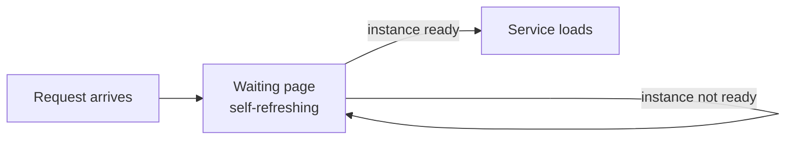

The **dynamic** strategy serves a self-refreshing waiting page while your instances start, then reloads into the real service once they are ready.

```Caddyfile
:80 {
	route /whoami {
		sablier http://sablier:10000 {
			group demo
			session_duration 1m
			dynamic {
				display_name My Whoami Service
			}
		}

		reverse_proxy whoami:80
	}
}
```

It is the right choice when a human is browsing directly to a frontend: they see a loading page instead of an error.



## Select the dynamic strategy

The strategy is chosen in your reverse-proxy plugin configuration, not on the Sablier server. For example, with the Caddy plugin you opt in with a `dynamic { ... }` block, as shown above. Each reverse proxy has its own syntax. See [Reverse proxies](/tutorials/reverse-proxies/) for the exact configuration of your plugin.

## Tune the waiting page

- `session_duration`: how long the instances stay up after the last request before scaling back to zero.
- `display_name`: the name shown on the waiting page.
- Refresh and theme options let you control how often the page reloads and how it looks.

To change the look of the page, pick a built-in theme or provide your own; see [Customize the theme](/how-to-guides/loading-strategies/customize-theme/). See the [themes example](https://github.com/sablierapp/sablier/tree/main/examples/custom-theme).

## Related

- [Strategies](/concepts/strategies/): how the dynamic strategy works conceptually.
- [Customize the theme](/how-to-guides/loading-strategies/customize-theme/): style the waiting page.
- [Reverse proxies](/tutorials/reverse-proxies/): the exact plugin syntax for each proxy.
