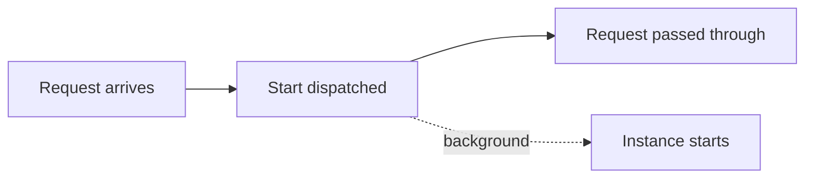

The **poke** strategy starts your instances and lets the request through immediately — no waiting page, no blocking.

```Caddyfile
:80 {
	route /whoami {
		sablier http://sablier:10000 {
			group demo
			session_duration 1m
			poke
		}

		reverse_proxy whoami:80
	}
}
```

It is the right choice for background services whose startup the caller does not need to wait for — video recorders, cache sidecars, build agents.



## Select the poke strategy

The strategy is chosen in your reverse-proxy plugin configuration. Each proxy has its own syntax for opting a route into the poke strategy. See [Reverse proxies](/tutorials/reverse-proxies/) for the exact configuration of your plugin.

## How it works

Poke dispatches the instance start but does not wait for it to become healthy. The session status is returned immediately as reported by the provider. The plugin passes the request through regardless.

If you need per-container control instead of per-route, use the `sablier.ready-on-start=true` label with the dynamic or blocking strategy. See [Configuration](/tutorials/configuration/#instance-labels).

## Related

- [Strategies](/concepts/strategies/): how the poke strategy works conceptually.
- [Reverse proxies](/tutorials/reverse-proxies/): the exact plugin syntax for each proxy.
