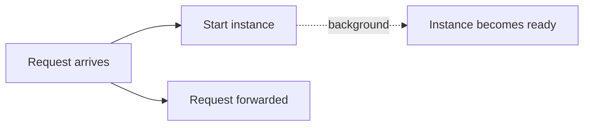
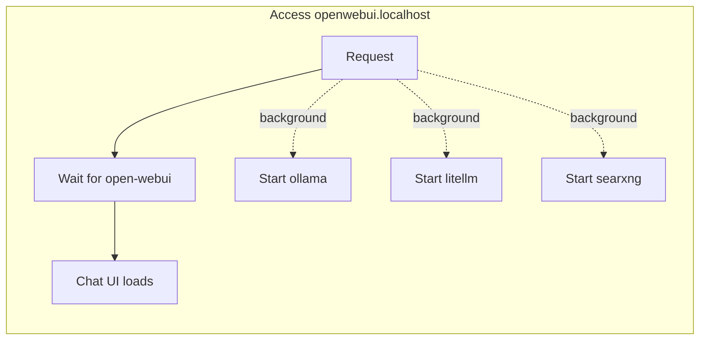

The **poke** strategy starts your instances and immediately lets the request continue. Unlike the `blocking` and `dynamic` strategies, it never waits for an instance to become ready and never displays a waiting page.

```Caddyfile
:80 {
	route /whoami {
		sablier http://sablier:10000 {
			group demo
			session_duration 1m
			poke
		}

		reverse_proxy whoami:80
	}
}
```

Use this strategy for services that should be started in response to a request but do not need to be available for that request. Typical examples include video recorders, cache sidecars, AI model servers, and build agents.



## Select the poke strategy

Configure the strategy in your reverse proxy plugin. Each supported reverse proxy has its own syntax for enabling the poke strategy on a route. See [Reverse proxies](/tutorials/reverse-proxies/) for configuration examples.

## How it works

When a request arrives, Sablier asks the provider to start the associated instance and immediately returns control to the reverse proxy. It does not wait for the instance to become healthy or ready to receive traffic. The request is always forwarded to the upstream service.

This makes `poke` suitable for background startup scenarios where the request itself does not depend on the instance being available.

If you need per-container control instead of per-route behavior, use the `sablier.ready-on-start=true` label with the `dynamic` or `blocking` strategy. See [Configuration](/tutorials/configuration/#instance-labels).

## Start companion services in the background

You can combine multiple Sablier middlewares on the same route. Use a `dynamic` middleware for the service that must be ready before handling the request, and `poke` middlewares for companion services that should start in the background.

### Example: Chat UI with AI services

`Open WebUI` depends on `Ollama`, `LiteLLM`, and `SearXNG`. Users only need to wait for `Open WebUI`, while the supporting services can start in the background.



Traefik
```yaml
http:
  routers:
    open-webui:
      rule: "Host(`open-webui.example.com`)"
      middlewares:
        - open-webui-sablier # dynamic
        - ollama-sablier # poke
        - litellm-sablier # poke
        - searxng-sablier # poke
```

## Related

- [Strategies](/concepts/strategies/): how the poke strategy works conceptually.
- [Reverse proxies](/tutorials/reverse-proxies/): the exact plugin syntax for each proxy.
