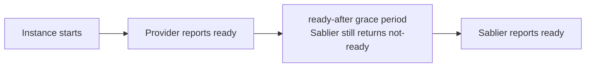



This guide shows you how to delay when Sablier reports an instance as ready with the `sablier.ready-after` label:

```yaml
# compose.yml
services:
  myapp:
    image: myapp:latest
    restart: unless-stopped
    labels:
      - "sablier.enable=true"
      - "sablier.group=myapp"
      - "sablier.ready-after=30s"  # wait 30 s after started/healthy before unblocking requests
```

Some services are started (or pass their health check) before they finish initialising. For example, a JVM application opens its HTTP port before loading all caches, a database accepts TCP connections before it's ready for queries, and a container without a health check may need a few extra seconds after start-up before it can serve traffic.

Setting `sablier.ready-after` introduces a mandatory settling delay. Once the provider reports the instance as ready (whether that means it has started or passed its health check), Sablier continues to return a *not-ready* response to any blocking or dynamic request until the grace period elapses.



The value is a Go duration string. Valid examples:

| Value | Duration |
|-------|----------|
| `500ms` | 500 milliseconds |
| `30s` | 30 seconds |
| `1m30s` | 1 minute 30 seconds |
| `2m` | 2 minutes |

If the label is absent or set to an unparseable value, no extra wait is applied.


The `sablier.ready-after` grace period counts from when the instance **first** becomes ready in a given session. It does not reset on subsequent requests.

