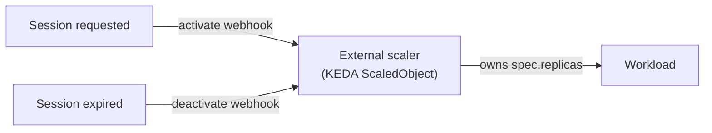



This guide shows you how to hand the replica count to an **external scaler** — typically a [KEDA](https://keda.sh) `ScaledObject` — while Sablier keeps deciding *when* a workload should be up. Instead of writing `spec.replicas` itself, Sablier emits `activate` and `deactivate` **intent webhooks** that your scaler acts on.

```yaml
# Deployment (Kubernetes)
metadata:
  labels:
    sablier.enable: "true"
  annotations:
    sablier.group: "myapp"
    sablier.delegate-scaling: "true"
```

## Why delegated scaling exists

KEDA's `ScaledObject` continuously reconciles a workload's replica count from its triggers, and it enforces `minReplicaCount` as a floor. When Sablier and KEDA both write `spec.replicas`, they fight:

1. A session expires, so Sablier scales the Deployment to **zero**.
2. KEDA's next reconcile sees the replica count below `minReplicaCount` and restores it to **one**.
3. That scale-from-zero is observed as a `started` event, so Sablier believes the workload is up — and it stays **latched at one replica forever**, never returning to zero.

Sablier writing replicas directly is fundamentally incompatible with any controller that also owns the replica count. Delegated scaling resolves this by making Sablier **stop writing replicas** for the labelled workload. It emits its intent as a webhook, and the scaler — which already owns the replica count — pauses or resumes its own reconciliation in response.

> This is the KEDA/HPA scale-to-zero coexistence problem discussed in [sablier#130](https://github.com/sablierapp/sablier/issues/130).



## The label

| Label | Format | Default | Example |
|-------|--------|---------|---------|
| `sablier.delegate-scaling` | Boolean | `false` | `"true"` |

When `sablier.delegate-scaling=true`:

- Sablier **never** calls the provider's start/stop (it never writes `spec.replicas`).
- A session request emits an `activate` intent instead of starting the workload.
- A session expiry (and the unregistered-instance scan) emits a `deactivate` intent instead of scaling to zero.
- The workload is **exempt** from the externally-started stopper (`provider.auto-stop-externally-started`), because the scaler legitimately owns its replica count while active.

Readiness is still observed the normal way: on subsequent requests Sablier inspects the workload and reports it ready once the scaler has brought it up.


On Kubernetes, `sablier.enable` must be a **label** (discovery uses a label selector). `sablier.delegate-scaling` may be set as either a label or an annotation; an annotation wins when both are present.


## Intent webhooks

Delegated scaling introduces two new webhook event types, delivered with the same [payload format](/how-to-guides/webhooks/#payload-format) as the lifecycle events:

```json
{
  "event": "activate",
  "instance": { "name": "myapp" },
  "timestamp": "2025-01-15T10:30:00Z"
}
```

```json
{
  "event": "deactivate",
  "instance": { "name": "myapp" },
  "timestamp": "2025-01-15T10:45:00Z"
}
```

### Explicit subscription is required

Unlike the lifecycle events (`started`/`stopped`), where an endpoint with no `events` filter receives **all** of them, intent events require an **explicit subscription**. An endpoint receives `activate`/`deactivate` **only** if its `events` filter lists them:

```yaml
# sablier.yaml
webhooks:
  endpoints:
    # This endpoint drives the scaler — it opts in explicitly.
    - url: http://keda-adapter.default.svc/scale
      events:
        - activate
        - deactivate

    # This existing endpoint has no filter. It keeps receiving started/stopped
    # and receives ZERO intent events — no new traffic.
    - url: https://uptime.example.com/api/push/xxxx
```

This makes delegated scaling **safe to enable incrementally**: turning the label on for a workload sends no intent traffic anywhere until an endpoint deliberately subscribes.

### Ordering and retries

Intent delivery is **load-bearing** — a reordered `deactivate`→`activate`, or a silently dropped delivery, would leave the scaler in the wrong state. So intent events are delivered on a separate watch with stronger guarantees than the best-effort lifecycle path:

- Events are delivered **strictly in order**, one at a time — the receiver observes them in the exact order Sablier emitted them.
- Each delivery is retried up to **5 attempts** with a linear backoff before Sablier gives up and moves on to the next event.

This contrasts with lifecycle (`started`/`stopped`) delivery, which is fire-and-forget with no retry (see [Delivery semantics](/how-to-guides/webhooks/#delivery-semantics)).

## KEDA walkthrough

The receiver's job is to translate an `activate`/`deactivate` into pausing or unpausing the `ScaledObject`, which KEDA does through the `autoscaling.keda.sh/paused` annotation. Pausing at the current replica count keeps the workload up; pausing at zero (or letting normal reconciliation resume) idles it.

### 1. Label the workload

```yaml
apiVersion: apps/v1
kind: Deployment
metadata:
  name: myapp
  labels:
    app: myapp
    sablier.enable: "true"
  annotations:
    sablier.group: "myapp"
    sablier.delegate-scaling: "true"
spec:
  replicas: 0
  selector:
    matchLabels:
      app: myapp
  template:
    metadata:
      labels:
        app: myapp
    spec:
      containers:
        - name: myapp
          image: myapp:latest
```

### 2. Let KEDA own the replica count

```yaml
apiVersion: keda.sh/v1alpha1
kind: ScaledObject
metadata:
  name: myapp
spec:
  scaleTargetRef:
    name: myapp
  minReplicaCount: 0
  maxReplicaCount: 3
  triggers:
    - type: cpu
      metricType: Utilization
      metadata:
        value: "70"
```

### 3. Point Sablier's intent webhook at your adapter

```yaml
# sablier.yaml
webhooks:
  endpoints:
    - url: http://keda-adapter.default.svc/scale
      events:
        - activate
        - deactivate
```

### 4. Translate intents into pause/unpause

Your adapter receives the intent payload and patches the `ScaledObject`. On `activate`, remove the paused annotation (or set it to keep the workload up) so KEDA resumes normal autoscaling; on `deactivate`, allow it to fall back to `minReplicaCount: 0`.

```bash
# activate: resume KEDA autoscaling (workload can scale up)
kubectl annotate scaledobject myapp autoscaling.keda.sh/paused-

# deactivate: pause at zero replicas (workload stays idle)
kubectl annotate --overwrite scaledobject myapp autoscaling.keda.sh/paused-replicas=0
```

Because Sablier never touches `spec.replicas`, KEDA remains the single writer of the replica count and the scale-to-zero race disappears.
