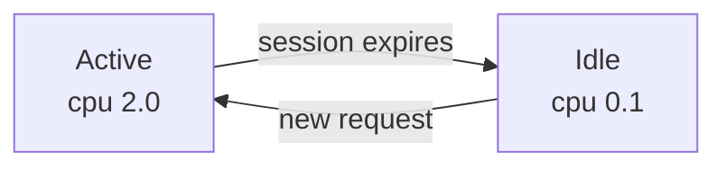



This guide shows you how to throttle an instance's CPU when idle and restore it on wake-up, using the `sablier.idle.cpu` and `sablier.active.cpu` labels:

```yaml
# compose.yml
services:
  myapp:
    image: myapp:latest
    restart: unless-stopped
    labels:
      - "sablier.enable=true"
      - "sablier.group=myapp"
      - "sablier.idle.replicas=1"
      - "sablier.idle.cpu=0.1"
      - "sablier.active.cpu=2.0"
```

In [scale mode](/how-to-guides/scaling-resources/scale-mode/), Sablier can throttle an instance's CPU when its session expires and restore it when a new session arrives, instead of stopping the workload. This keeps the instance warm (no cold start) while preventing an idle workload from consuming CPU that active workloads need.

On Docker, CPU values are decimal fractions of one core (`"0.5"` = half a core). When the session expires, Sablier runs the equivalent of `docker update --cpus=0.1 myapp`; when a new session is requested it restores `--cpus=2.0`. The container is never stopped.



## Labels

| Label | Applied when | Format |
|-------|--------------|--------|
| `sablier.idle.cpu` | session expires | decimal cores (Docker/Swarm/Podman) or [Kubernetes quantity](https://kubernetes.io/docs/concepts/configuration/manage-resources-containers/#resource-units-in-kubernetes) |
| `sablier.active.cpu` | session requested | same |

Both require `sablier.idle.replicas >= 1` so the workload keeps running while idle. See [Scale instead of stop](/how-to-guides/scaling-resources/scale-mode/) for the shared `idle`/`active` model.

## Provider specifics

See [Applying labels](/reference/labels/#applying-labels) for how each provider expresses labels; below are this feature's values.



Same decimal-core format as Docker. Sablier updates the service's task template.

```yaml
services:
  myapp:
    image: myapp:latest
    deploy:
      replicas: 1
      labels:
        - "sablier.enable=true"
        - "sablier.group=myapp"
        - "sablier.idle.replicas=1"
        - "sablier.idle.cpu=0.1"
        - "sablier.active.cpu=2.0"
```


CPU uses the standard [resource-quantity](https://kubernetes.io/docs/concepts/configuration/manage-resources-containers/#resource-units-in-kubernetes) format (`"100m"`, `"2"`, `"2000m"`).

```yaml
apiVersion: apps/v1
kind: Deployment
metadata:
  name: myapp
  labels:
    sablier.enable: "true"
    sablier.group: myapp
    sablier.idle.replicas: "1"
    sablier.idle.cpu: "100m"
    sablier.active.cpu: "2000m"
```


Changing CPU limits triggers a **rolling restart** of the pods; the service stays available during the transition.



Identical to Docker: decimal cores, same labels.

```yaml
services:
  myapp:
    image: myapp:latest
    labels:
      - "sablier.enable=true"
      - "sablier.group=myapp"
      - "sablier.idle.replicas=1"
      - "sablier.idle.cpu=0.1"
      - "sablier.active.cpu=2.0"
```


