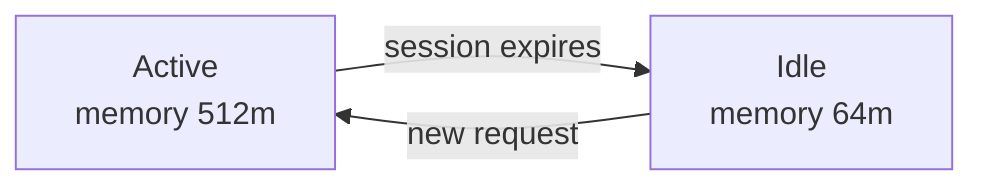



This guide shows you how to cap an instance's memory when idle and restore it on wake-up, using the `sablier.idle.memory` and `sablier.active.memory` labels:

```yaml
# compose.yml
services:
  myapp:
    image: myapp:latest
    restart: unless-stopped
    labels:
      - "sablier.enable=true"
      - "sablier.group=myapp"
      - "sablier.idle.replicas=1"
      - "sablier.idle.memory=64m"
      - "sablier.active.memory=512m"
```

In [scale mode](/how-to-guides/scaling-resources/scale-mode/), Sablier can cap an instance's memory when idle and restore it on wake-up, keeping the workload running instead of stopping it.

On Docker, memory values use Docker-style suffixes (`b`, `k`, `m`, `g`). On session expiry Sablier runs the equivalent of `docker update --memory=64m myapp` and restores `--memory=512m` on wake-up.




Docker requires the memory swap limit to be updated together with the memory limit. Sablier sets `MemorySwap` equal to `Memory` automatically, which disables swap for the container.


## Labels

| Label | Applied when | Format |
|-------|--------------|--------|
| `sablier.idle.memory` | session expires | Docker units (`b`, `k`, `m`, `g`) or Kubernetes quantity |
| `sablier.active.memory` | session requested | same |

Both require `sablier.idle.replicas >= 1`. See [Scale instead of stop](/how-to-guides/scaling-resources/scale-mode/) for the shared model.

## Provider specifics

See [Applying labels](/reference/labels/#applying-labels) for how each provider expresses labels; below are this feature's values.



Same units as Docker.

```yaml
services:
  myapp:
    image: myapp:latest
    deploy:
      replicas: 1
      labels:
        - "sablier.enable=true"
        - "sablier.group=myapp"
        - "sablier.idle.replicas=1"
        - "sablier.idle.memory=64m"
        - "sablier.active.memory=512m"
```


Memory uses the resource-quantity format (`"64Mi"`, `"512Mi"`, `"1Gi"`).

```yaml
apiVersion: apps/v1
kind: Deployment
metadata:
  name: myapp
  labels:
    sablier.enable: "true"
    sablier.group: myapp
    sablier.idle.replicas: "1"
    sablier.idle.memory: "64Mi"
    sablier.active.memory: "512Mi"
```


Identical to Docker: same units and labels.


