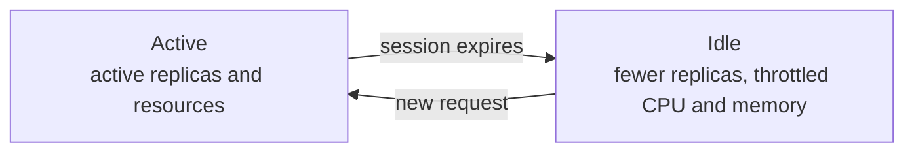



This guide shows you how to scale a workload down instead of stopping it, using the `sablier.idle.replicas` and `sablier.active.replicas` labels:

```yaml
# compose.yml
services:
  myapp:
    image: myapp:latest
    labels:
      - "sablier.enable=true"
      - "sablier.group=myapp"
      - "sablier.idle.replicas=1"
      - "sablier.active.replicas=2"
```

Scale mode is an alternative to stopping containers: instead of shutting down and restarting the workload, Sablier **scales down the replica count** when the session expires and **restores it** when a new session is requested.

Optionally, when `sablier.idle.replicas >= 1`, the workload **keeps running** at the idle replica count with **throttled resources** (CPU, memory, and block I/O on Docker), and the resources are **restored** when a new session arrives. This eliminates cold-start latency at the cost of keeping the workload alive.



## Idle and active profiles

Every scale-mode label comes in an `idle` and an `active` variant:

- **`idle.*`** is applied when the session **expires**.
- **`active.*`** is restored when a new session is **requested**.

| Label | Format | Default | Example |
|-------|--------|---------|---------|
| `sablier.idle.replicas` | Integer | `0` (stop) | `"1"` |
| `sablier.active.replicas` | Integer | `1` | `"2"` |
| `sablier.idle.cpu` / `sablier.active.cpu` | see [Scale CPU](/how-to-guides/scaling-resources/scale-cpu/) | none | `"0.1"`, `"500m"` |
| `sablier.idle.memory` / `sablier.active.memory` | see [Scale memory](/how-to-guides/scaling-resources/scale-memory/) | none | `"64m"`, `"128Mi"` |
| `sablier.idle.blkio-*` / `sablier.active.blkio-*` | see [Scale block I/O](/how-to-guides/scaling-resources/scale-blkio/) | none | `"100"`, `"/dev/sda:10m"` |

When `sablier.idle.replicas` is `0` (the default), Sablier stops the workload on session expiry and restarts it on demand. Set it to `1` or higher to keep the workload running with optional resource throttling.

A limit set on the `idle` profile is **not** cleared automatically on wake-up. Set the corresponding `active` label to restore it.

## Provider specifics

See [Applying labels](/reference/labels/#applying-labels) for how each provider expresses labels; below are this feature's values.



CPU is decimal cores (`"0.5"` = half a core); memory uses Docker suffixes (`b`, `k`, `m`, `g`). On session expiry Sablier runs the equivalent of `docker update` with the idle limits and restores the active limits on wake-up. The container is never stopped.


Same value formats as Docker. Resource changes update the service's task template, triggering a task re-schedule.


CPU and memory use [resource quantities](https://kubernetes.io/docs/concepts/configuration/manage-resources-containers/#resource-units-in-kubernetes) (`"500m"`, `"2"`, `"128Mi"`, `"1Gi"`).


Resource limit changes trigger a **rolling restart** of the pods. The service stays available during the transition (old pods are replaced with new ones), with brief overlap.



Scale mode changes resource **limits**, not requests. Ensure your nodes have sufficient allocatable capacity for the active limits.



Identical to Docker: decimal CPU cores and Docker-style memory units, same labels.



## Per-resource guides


  
  
  

