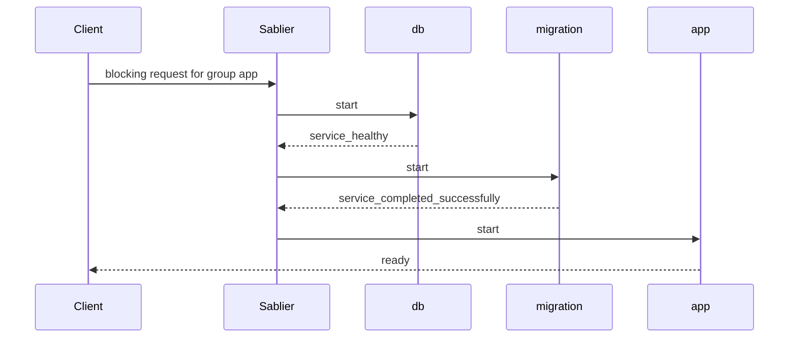

Bring a managed service's entire `depends_on` graph back up in order, waiting for each declared condition, the moment a request arrives.

```yaml
# compose.yml
services:
  sablier:
    image: sablierapp/sablier:
    command:
      - start
      - --provider.name=docker
      - --provider.docker.honor-restart-policy=true
      - --sessions.default-duration=2m
      - --strategy.blocking.default-timeout=2m
    volumes:
      - /var/run/docker.sock:/var/run/docker.sock

  app:
    image: sablierapp/mimic:v0.3.3
    labels:
      - "sablier.enable=true"
      - "sablier.group=app"
    depends_on:
      db:
        condition: service_healthy
      migration:
        condition: service_completed_successfully

  db:
    image: sablierapp/mimic:v0.3.3
    labels:
      - "sablier.enable=true"
      - "sablier.group=app"

  migration:
    image: sablierapp/mimic:v0.3.3
    restart: "no"
```

When a blocking request for the `app` group arrives, Sablier starts `db` and waits until it is healthy, starts `migration` and waits until it has completed, then starts `app`. Here `db` is labelled so it scales to zero with the group; `migration` is left unlabeled because it is a one-shot job.



Many applications cannot start in isolation. A web app often needs its database to be healthy and a schema migration to have completed before it can serve traffic. When Sablier scales such an app to zero, it must bring the whole dependency graph back up, in the right order, the moment a request arrives.

The Docker provider does this by reading each container's Compose [`depends_on`](https://docs.docker.com/compose/how-tos/startup-order/) relationships (Compose records them in the `com.docker.compose.depends_on` label) and starting every dependency, recursively, before the container that needs it, waiting for each declared condition to be satisfied.

## When to use it

Use this when a managed service has dependencies that must be up and ready before it starts, such as a database (`service_healthy`) or a one-shot migration job (`service_completed_successfully`).

## Do I need to label dependencies?

- **Starting** a `depends_on` dependency does **not** require any Sablier labels. As long as a labelled container declares the dependency, Sablier starts it and waits for its condition.
- **Stopping** only happens for containers explicitly labelled `sablier.enable=true` and belonging to the group. Label a dependency (for example a database) if you want it scaled to zero with the group; leave it unlabeled if it should keep running.
- **Never** put a one-shot container (a migration or init job that exits by design) into a blocking group. The blocking strategy waits for every group member to be running, so an exited container would keep the group from ever becoming ready. Leave it unlabeled and let `depends_on` trigger it.

A one-shot dependency resolving `service_completed_successfully` relies on the exited container being reported as `completed`. See [Honor the restart policy](/how-to-guides/startup-dependencies/restart-policy/).

See the [runnable example](https://github.com/sablierapp/sablier/tree/main/examples/depends-on).
