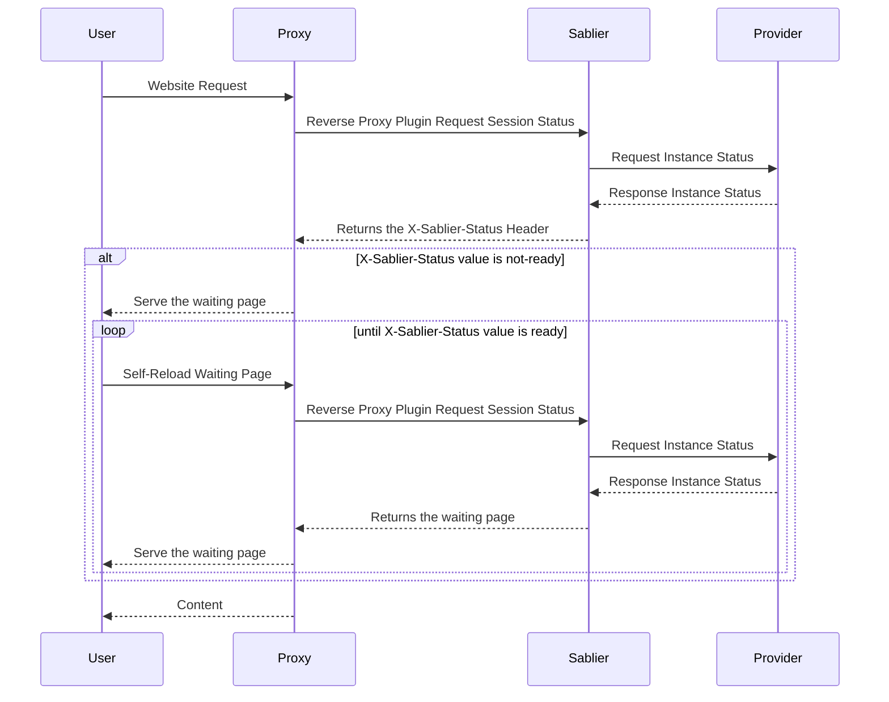
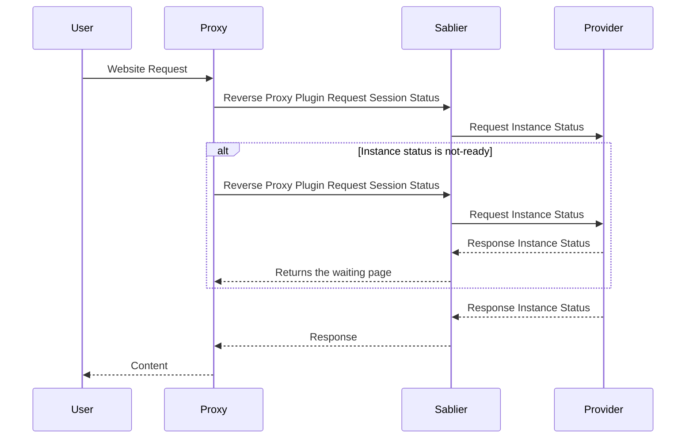

## Dynamic Strategy

The **Dynamic Strategy** displays a waiting page while your session starts.


This strategy is ideal for users accessing a frontend directly, as they'll see a loading page while their services start.


The waiting page is rendered from a [theme](/strategies/themes/) — use a built-in one or provide your own.

## Blocking Strategy

The **Blocking Strategy** holds the request until your session is ready.


This strategy is ideal for API communication, where clients expect to wait for a response.


