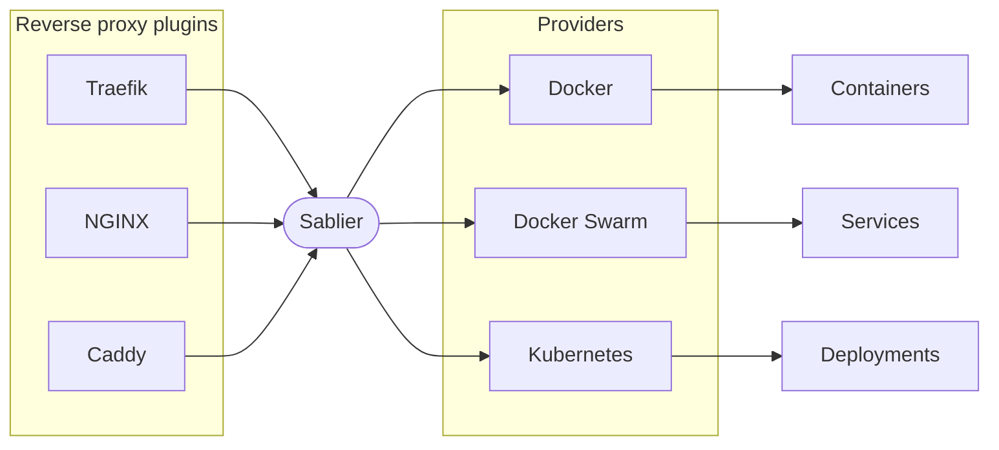

In this tutorial, you set up Sablier as scale-to-zero middleware behind a reverse proxy. You start from a plain service, place Sablier in front of it, and watch the service stop when it is idle and start again when a request arrives.

If Sablier is new to you, read [how Sablier works](/concepts/how-sablier-works/) for a short overview. You also need Sablier installed; see [install Sablier](/tutorials/installation/).



## Identify your provider

First, identify your [provider](/tutorials/providers/). The provider is how Sablier talks to your platform. You can see the available providers on the [providers](/tutorials/providers/) page.

## Identify your reverse proxy

Next, identify your [reverse proxy](/tutorials/reverse-proxies/). The reverse-proxy plugin intercepts incoming requests and calls the Sablier API. You can see the available plugins on the [reverse proxies](/tutorials/reverse-proxies/) page.

## Connect it all together

This tutorial uses the [Docker provider](/tutorials/providers/docker/) and the [Caddy reverse proxy plugin](/tutorials/reverse-proxies/caddy/). The steps are the same for other combinations; only the provider and plugin configuration change.

{}

### Initial setup with Caddy

Start from an ordinary setup, before Sablier is involved. Caddy reverse-proxies requests for `/whoami` to a `whoami` service.




```yaml
services:
  proxy:
    image: caddy:2.8.4
    ports:
      - "8080:80"
    volumes:
      - ./Caddyfile:/etc/caddy/Caddyfile:ro

  whoami:
    image: acouvreur/whoami:v1.10.2
```




```Caddyfile
:80 {
	route /whoami {
		reverse_proxy whoami:80
	}
}
```




Run `docker compose up` and open `http://localhost:8080/whoami`. The `whoami` service responds.

### Install Sablier with the Docker provider

Add a Sablier container to your `docker-compose.yaml`. It uses the Docker provider, so it needs access to the Docker socket.

```yaml
services:
  proxy:
    image: caddy:2.8.4
    restart: unless-stopped
    ports:
      - "8080:80"
    volumes:
      - ./Caddyfile:/etc/caddy/Caddyfile:ro

  whoami:
    image: acouvreur/whoami:v1.10.2
    restart: unless-stopped

  sablier:
    image: sablierapp/sablier:
    restart: always
    command:
        - start
        - --provider.name=docker
    volumes:
      - '/var/run/docker.sock:/var/run/docker.sock'
```

### Add the Sablier Caddy plugin to Caddy

Caddy does not load plugins at runtime, so you build a Caddy image that includes the Sablier plugin. The plugin repository provides a Dockerfile for this.

```bash
docker build https://github.com/sablierapp/sablier-caddy-plugin.git \
  --build-arg=CADDY_VERSION=2.8.4 \
  -t caddy:2.8.4-with-sablier
```

Then update the `proxy` service to use the image you built, `caddy:2.8.4-with-sablier`.

```yaml
services:
  proxy:
    image: caddy:2.8.4-with-sablier
    restart: unless-stopped
    ports:
      - "8080:80"
    volumes:
      - ./Caddyfile:/etc/caddy/Caddyfile:ro

  whoami:
    image: acouvreur/whoami:v1.10.2
    restart: unless-stopped

  sablier:
    image: sablierapp/sablier:
    restart: always
    command:
        - start
        - --provider.name=docker
    volumes:
      - '/var/run/docker.sock:/var/run/docker.sock'
```

### Opt your service in with labels

Add the `sablier.enable` and `sablier.group` labels to the service you want Sablier to manage. These labels tell Sablier which workload to start on demand, and the group name lets the plugin refer to it.

```yaml
services:
  proxy:
    image: caddy:2.8.4-with-sablier
    restart: unless-stopped
    ports:
      - "8080:80"
    volumes:
      - ./Caddyfile:/etc/caddy/Caddyfile:ro

  whoami:
    image: acouvreur/whoami:v1.10.2
    restart: unless-stopped
    labels:
      - sablier.enable=true
      - sablier.group=demo

  sablier:
    image: sablierapp/sablier:
    restart: always
    command:
        - start
        - --provider.name=docker
    volumes:
      - '/var/run/docker.sock:/var/run/docker.sock'
```


We've assigned the group `demo` to the service, which is how we identify the workload. See [Groups](/concepts/groups/) to learn more.


### Configure the Sablier plugin in your Caddyfile

Now connect the route to Sablier in your `Caddyfile`. The `dynamic` block serves a self-refreshing waiting page while the service starts. Here it also selects a built-in theme and shows the instance details on that page.

```Caddyfile
:80 {
    route /whoami {
        sablier http://sablier:10000 {
            group demo
            session_duration 1m
            dynamic {
                display_name My Whoami Service
                theme ghost
                show_details true
            }
        }

        reverse_proxy whoami:80
    }
}
```

This configuration applies to requests for `http://localhost:8080/whoami`:
- Containers labelled `sablier.group=demo` start on demand.
- After one minute without traffic, the containers stop.
- The dynamic strategy shows a waiting page while the service starts, using the display name `My Whoami Service`, the built-in `ghost` theme, and the instance details.

Sablier ships several built-in themes, including `ghost`, `shuffle`, `hacker-terminal`, and `matrix`. You can also provide your own. See [Customize your theme](/how-to-guides/loading-strategies/customize-theme/).

### Reach the endpoint and watch it load

Start the whole stack:

```bash
docker compose up -d
```

1. Open [http://localhost:8080/whoami](http://localhost:8080/whoami). The `whoami` container is running, so Sablier passes the request through and you see the service.
2. Leave the page idle for one minute. Because `session_duration` is `1m`, Sablier stops `whoami` once no traffic arrives. Confirm this with `docker compose ps`, where `whoami` no longer appears.
3. Refresh [http://localhost:8080/whoami](http://localhost:8080/whoami). The container is stopped, so the Caddy plugin passes the request to Sablier. Sablier starts `whoami` again and serves the waiting page while it starts:


The waiting page refreshes on its own. When `whoami` reports ready, Sablier reloads the page into the running service, with no action needed from you.

You have now followed a request through the full path: a stopped service, a waiting page, and the running application. This is scale-to-zero from end to end.


To hold the request until the service is ready instead of showing a waiting page, replace the `dynamic` block with a `blocking` block. To start instances without waiting at all, use a `poke` block. See [Loading strategies](/how-to-guides/loading-strategies/) for all three.


{}
