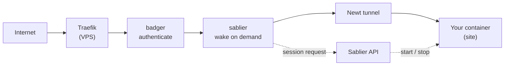

[Pangolin](https://github.com/fosrl/pangolin) is not a reverse proxy of its own. It drives a **Traefik v3** instance whose dynamic configuration it generates from its own database. Sablier therefore integrates with Pangolin through the regular **[Traefik plugin](/tutorials/reverse-proxies/traefik/)** — there is nothing Pangolin-specific to install on the Sablier side, and no separate plugin to build.

What *is* specific to Pangolin is **where each piece runs** and **how you attach the middleware to a resource**. This guide covers both.


A complete, runnable stack is available in the plugin repository: **[examples/pangolin](https://github.com/sablierapp/sablier-traefik-plugin/tree/main/examples/pangolin)**.


## How Pangolin drives Traefik

Pangolin's Traefik reads from two dynamic providers at once:

| Provider | Source | Who owns it |
| --- | --- | --- |
| `http` | `http://pangolin:3001/api/v1/traefik-config` | Pangolin — regenerated from the database every 5s |
| `file` | `/etc/traefik/dynamic_config.yml` | **You** — hand-edited, mounted from `config/traefik/` |

Every router Pangolin generates gets the `badger` middleware (its forward-auth plugin) prepended to the chain. Both the static config (`config/traefik/traefik_config.yml`) and the file-provider config are plain files on disk that you are free to edit — that is what makes the integration possible.



## 1. Load the plugin

Add Sablier next to the `badger` entry already present in `config/traefik/traefik_config.yml`:

```yaml
# config/traefik/traefik_config.yml
experimental:
  plugins:
    badger:
      moduleName: "github.com/fosrl/badger"
      version: "v1.5.0"        # leave whatever version your install shipped with
    sablier:
      moduleName: "github.com/sablierapp/sablier-traefik-plugin"
      version: "v1.3.0"
```

Restart Traefik. Yaegi downloads and compiles the plugin at startup, so watch the logs on the first boot.

## 2. Make Sablier reachable from Traefik

This is the part that trips people up. Sablier needs the **Docker socket** of the machine running your containers, while Traefik runs on the **Pangolin VPS**. In a tunnelled setup those are two different machines.

### Traefik and your containers on the same host

Nothing special — put Sablier on the same Docker network as Traefik and use `sablierUrl: http://sablier:10000`. This is the case covered by the [example](https://github.com/sablierapp/sablier-traefik-plugin/tree/main/examples/pangolin).

### Containers behind a Newt tunnel

Sablier runs **on the site**, alongside Docker. Traefik reaches targets on a Newt site at `http://<site subnet>:<internal port>`, and Pangolin allocates that internal port when you create a target — so Sablier has to be declared as a Pangolin resource to become reachable:

1. Create an HTTP resource for Sablier (for example `sablier.example.com`) whose target is the Sablier container, port `10000`.
2. Disable authentication on that resource, then restrict it with a Pangolin rule allowing only your VPS's IP. **Do not leave the Sablier API open** — it can start and stop containers.
3. Point `sablierUrl` at that URL.

Alternatively, run Sablier **on the VPS** and let it talk to the remote Docker daemon: Sablier builds its Docker client with `client.FromEnv`, so `DOCKER_HOST`, `DOCKER_TLS_VERIFY` and `DOCKER_CERT_PATH` are all honoured. Pair it with a [socket proxy](https://github.com/sablierapp/sablier/tree/main/examples/docker-socket-proxy) rather than exposing the raw socket across the tunnel.

## 3. Declare the middleware

Pangolin never generates Sablier middleware for you, so declare it in the file provider. One middleware instance per Sablier group:

```yaml
# config/traefik/dynamic_config.yml
http:
  middlewares:
    sablier-photoprism:
      plugin:
        sablier:
          sablierUrl: http://sablier:10000
          group: photoprism
          sessionDuration: 30m
          dynamic:
            displayName: PhotoPrism
            theme: ghost
```

The full option reference lives in the [plugin README](https://github.com/sablierapp/sablier-traefik-plugin#configuration).

## 4. Attach the middleware to a resource

Pangolin has no per-resource middleware field, so getting the middleware onto a
router takes one of three approaches. They differ on two axes: whether you can
target a single resource, and whether Pangolin authenticates the request
*before* Sablier wakes the container.

| | Per-resource | Auth before wake | Extra service |
| --- | --- | --- | --- |
| [`additional_middlewares`](#a--additional_middlewares) | ✗ global | ✓ | ✗ |
| [Middleware Manager](#b--middleware-manager) | ✓ | ✗ | ✓ |
| [Shadow the router](#c--shadow-the-router-by-hand) | ✓ | ✓ | ✗ |

### A — `additional_middlewares`

Pangolin appends this list to every router it generates, right after `badger`:

```yaml
# config/config.yml
traefik:
    additional_middlewares:
      - sablier-photoprism@file
```

The `@file` suffix is required: the middleware is defined in the file provider
while the routers live in the `http` provider.


`additional_middlewares` is **global**. Every HTTP resource in your Pangolin
install goes through this middleware, and therefore through this one Sablier
group. Use it only when you have a single Sablier-managed resource. Pangolin's
own dashboard routers are declared in `dynamic_config.yml` and are *not*
affected.


### B — Middleware Manager

[Middleware Manager](https://github.com/hhftechnology/middleware-manager) is a
community service, listed in [Pangolin's own
docs](https://docs.pangolin.net/self-host/community-guides/middlewaremanager),
that reads resources from Pangolin's internal API and re-serves Traefik's
dynamic configuration with middlewares attached per resource. You point
Traefik's HTTP provider at it instead of at Pangolin:

```yaml
# config/traefik/traefik_config.yml
providers:
  http:
    endpoint: "http://middleware-manager:3456/api/v1/traefik-config"
    pollInterval: "5s"
```

Keep the Sablier middleware declared in the file provider and attach it as an
*external* middleware, from the UI or the API:

```bash
curl -X POST http://middleware-manager:3456/api/resources/<id>/external-middlewares \
  -H 'Content-Type: application/json' \
  -d '{"middleware_name":"sablier-photoprism@file","priority":100,"provider":"file"}'
```


Middleware Manager always places its own additions **before** the router's
existing middlewares, so Sablier runs *before* `badger`. The `priority` field
only orders Middleware Manager's own assignments among themselves — it cannot
move one after `badger`.

The consequence is that anyone who can reach the hostname can wake the
container without authenticating. If that matters, use option A or C.


Note also that Traefik's whole dynamic configuration now comes from Middleware
Manager, so if it stops, Traefik loses every Pangolin-generated router — not
just the Sablier attachment.

### C — Shadow the router by hand

Per-resource *and* authentication-first, at the cost of hand-maintained config.
Declare your own router in the file provider that shadows the generated one with
a higher priority, and reuse Pangolin's generated service instead of duplicating
the target:

```yaml
# config/traefik/dynamic_config.yml
http:
  routers:
    photoprism-sablier:
      rule: "Host(`photoprism.example.com`)"
      priority: 1000                       # Pangolin's routers default to 100
      entryPoints:
        - websecure
      middlewares:
        - badger@http                      # keep Pangolin's authentication
        - sablier-photoprism
      service: "3-photoprism-service@http" # <resourceId>-<resource name>-service
      tls:
        certResolver: letsencrypt
```

Rather than guessing the generated names, copy the real router from Traefik's
API and edit it:

```bash
curl -s http://localhost:8080/api/http/routers | jq '.[] | select(.provider=="http")'
```

Then add the Sablier middleware, raise the priority, and keep the `service`,
`rule` and `tls` blocks as Traefik reports them.

This shadows a router Pangolin owns, so re-check it after changing the
resource's domain, path rules or TLS settings in the Pangolin UI.

## 5. Label your containers

Group membership is declared on the container itself, at the site — not in the proxy:

```yaml
# compose.yml, on the machine running your apps
services:
  photoprism:
    image: photoprism/photoprism:latest
    labels:
      - "sablier.enable=true"
      - "sablier.group=photoprism"
```

## Caveats

- **Check the middleware ordering.** With `additional_middlewares` or a hand-written router, `badger` runs before Sablier and the waiting page is only ever served to authenticated users. Middleware Manager reverses this — see the warning in [step 4](#b--middleware-manager).
- **Health checks.** Pangolin drops targets it considers `unhealthy` from the load balancer. Leave health checks off for Sablier-managed targets, or a stopped container will be removed from the config that Sablier needs in order to wake it.
- **Per-resource middleware support** is not a Pangolin feature today, which is why options B and C exist at all. If Pangolin gains a middleware field on the resource itself, both become unnecessary.
