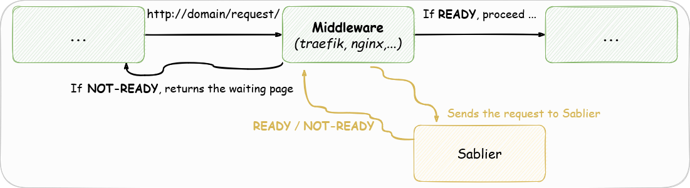

# Reverse Proxy Plugins

## What is a Reverse Proxy Plugin?

Reverse proxy plugins provide integration with a reverse proxy.

?> Because Sablier is designed as an API that can be used independently, reverse proxy integrations act as clients of that API.

They leverage API calls to intercept in-flight requests and communicate with Sablier.

## Available Reverse Proxies

| Reverse Proxy                 | Docker | Docker Swarm mode | Kubernetes |
| ----------------------------- | :----: | :---------------: | :--------: |
| [Apache APISIX](apacheapisix) |   ✅    |         ✅         |     ✅      |
| [Caddy](caddy)                |   ✅    |         ✅         |     ❌      |
| [Envoy](envoy)                |   ✅    |         ❓         |     ❓      |
| [Istio](istio)                |   ❌    |         ❌         |     ⚠️      |
| [Nginx](nginx_proxywasm)      |   ✅    |         ❓         |     ❓      |
| [Traefik](traefik)            |   ✅    |         ✅         |     ✅      |
| [ProxyWasm](proxywasm)        |   ✅    |         ✅         |     ✅      |

> ✅ **Fully compatible**
> 
> ⚠️ **Partially compatible**
> 
> ❓ **Should be compatible (but not tested)**
> 
> ❌ **Not compatible**

*Your Reverse Proxy is not on the list? [Open an issue to request the missing reverse proxy integration here!](https://github.com/sablierapp/sablier/issues/new?assignees=&labels=enhancement%2C+reverse-proxy&projects=&template=reverse-proxy-integration-request.md&title=Add+%60%5BREVERSE+PROXY%5D%60+reverse+proxy+integration)*

## Runtime and Compiled Plugins

Some reverse proxies can evaluate plugins at runtime (e.g., Traefik with Yaegi, NGINX with Lua and JavaScript plugins), which means the reverse proxy can consume the plugin directly without recompilation.

Others require you to rebuild your reverse proxy with the plugin included (e.g., Caddy).