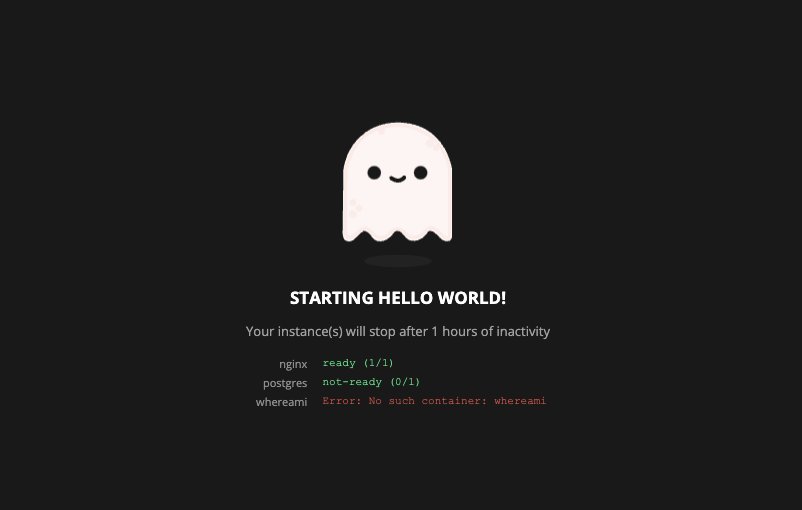
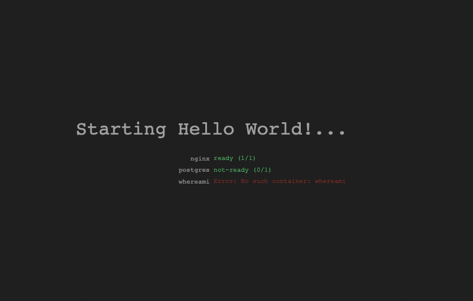
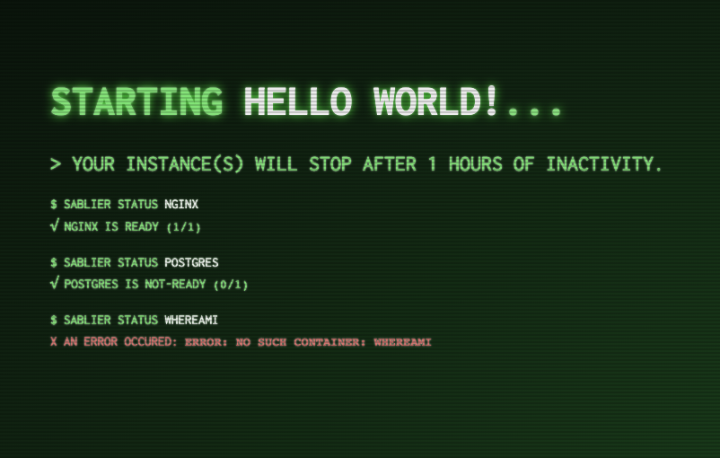

# Themes

Sablier comes with a set of default themes that you can use.

You can also extend the themes by providing your own, which will be rendered as Go Templates.

## The Embedded Themes


|       Name        |                                                  Preview                                                  |
| :---------------: | :-------------------------------------------------------------------------------------------------------: |
|      `ghost`      |                      |
|     `shuffle`     |                  |
| `hacker-terminal` |  |
|     `matrix`      |                    |


## Custom Themes Locations

You can use the `--strategy.dynamic.custom-themes` argument to define the location where Sablier should search for themes at startup.

By default, the docker image looks for themes located inside the `/etc/sablier/themes` folder.

<!-- x-release-please-start-version -->
```yaml
services:
  sablier:
    image: sablierapp/sablier:1.10.1
    volumes:
      - '/var/run/docker.sock:/var/run/docker.sock'
      - '/path/to/my/themes:/etc/sablier/themes'
```
<!-- x-release-please-end -->

Sablier will recursively search for themes with the `.html` extension.

- You **cannot** load new themes added to the folder without restarting
- You **can** modify existing theme files without restarting

## Create a Custom Theme

Themes are served using [Go Templates](https://pkg.go.dev/text/template).

### Available Go Template Values

| Template Key                                  | Template Value                                                                                                      | Go Template Usage                                                                        |
| --------------------------------------------- | ------------------------------------------------------------------------------------------------------------------- | ---------------------------------------------------------------------------------------- |
| `.DisplayName`                                | The display name configured for the session                                                                         | `{{ .DisplayName }}`                                                                     |
| `.InstanceStates`                             | An array of `RenderOptionsInstanceState` that represents the state of each required instances                       | `{{- range $i, $instance := .InstanceStates }}{{ end -}}`                                |
| `.SessionDuration`                            | The humanized session duration from a [time.Duration](https://pkg.go.dev/time#Duration)                             | `{{ .SessionDuration }}`                                                                 |
| `.RefreshFrequency`                           | The refresh frequency for the page. See [The `<meta http-equiv="refresh" />` tag](#the-meta-http-equivrefresh--tag) | `<meta http-equiv="refresh" content="{{ .RefreshFrequency }}" />`                        |
| `.Version`                                    | Sablier version as a string                                                                                         | `{{ .Version }}`                                                                         |
| `$RenderOptionsInstanceState.Name`            | The name of the instance loading                                                                                    | `{{- range $i, $instance := .InstanceStates }}{{ $instance.Name }}{{ end -}}`            |
| `$RenderOptionsInstanceState.CurrentReplicas` | The number of current replicas of the instance loading                                                              | `{{- range $i, $instance := .InstanceStates }}{{ $instance.CurrentReplicas }}{{ end -}}` |
| `$RenderOptionsInstanceState.DesiredReplicas` | The number of desired replicas of the instance loading                                                              | `{{- range $i, $instance := .InstanceStates }}{{ $instance.DesiredReplicas }}{{ end -}}` |
| `$RenderOptionsInstanceState.Status`          | The status of the instance loading, `ready` or `not-ready`                                                          | `{{- range $i, $instance := .InstanceStates }}{{ $instance.Status }}{{ end -}}`          |
| `$RenderOptionsInstanceState.Error`           | The error trigger by this instance which won't be able to load                                                      | `{{- range $i, $instance := .InstanceStates }}{{ $instance.Error }}{{ end -}}`           |

### The `<meta http-equiv="refresh" />` tag

The auto-refresh is accomplished using the [HTML <meta> http-equiv Attribute](https://www.w3schools.com/tags/att_meta_http_equiv.asp).

> Defines a time interval for the document to refresh itself.

The first step to creating your own theme is to include the `HTML <meta> http-equiv Attribute` as follows:

```html
<head>
  ...
  <meta http-equiv="refresh" content="{{ .RefreshFrequency }}" />
  ...
</head>
```

## The `showDetails` Option

If `showDetails` is set to `false`, the `.InstanceStates` will be an empty array.

## How to Load Your Custom Theme

You can load themes by specifying their name and relative path from the `--strategy.dynamic.custom-themes-path` value.

```bash
/my/custom/themes/
├── custom1.html      # custom1
├── custom2.html      # custom2
└── special
    └── secret.html   # special/secret
```

For example:

```bash
curl 'http://localhost:10000/api/strategies/dynamic?session_duration=1m&names=nginx&theme=custom1'
```

## See the Available Themes from the API

```bash
curl 'http://localhost:10000/api/strategies/dynamic/themes'
```
```json
{
  "custom": [
    "custom"
  ],
  "embedded": [
    "ghost",
    "hacker-terminal",
    "matrix",
    "shuffle"
  ]
}
```